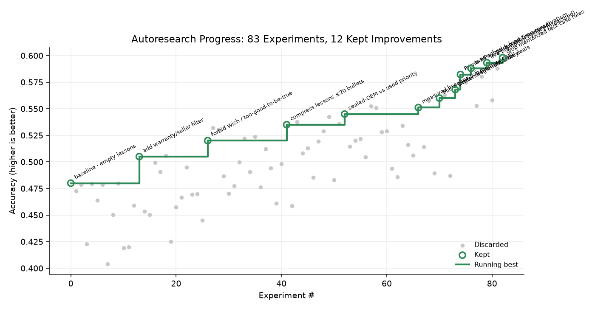

# autoresearch



*One day, frontier AI research used to be done by meat computers in between eating, sleeping, having other fun, and synchronizing once in a while using sound wave interconnect in the ritual of "group meeting". That era is long gone. Research is now entirely the domain of autonomous swarms of AI agents running across compute cluster megastructures in the skies... This repo is the story of how it all began. —@karpathy, March 2026*

**AITX SAT 2026 edition.** Same loop as [karpathy/autoresearch](https://github.com/karpathy/autoresearch): an agent edits one file, runs a fixed evaluation, **keeps** the change if the metric Pareto-improves, otherwise **discards** via git. Here the artifact under optimization is a GPU-purchase **policy** (lessons text), scored on a frozen golden set — not `val_bpb` on a GPT.

```
accuracy ↑ · retrieval_s ↓ · deal_safety ≥ champion · no Micro-Center-only bait as primary buy
```

---

## How it works

The research surface is deliberately tiny — the same three files that matter in Karpathy's repo:

| File | Role | Who edits |
|------|------|-----------|
| **`prepare.py`** | Fixed constants, golden dataset, evaluation harness | Nobody (read-only) |
| **`train.py`** | Policy lessons + knobs; one experiment run | **Agent** |
| **`program.md`** | Keep/discard loop instructions | Human |

```bash
# 1. sanity-check the harness
python prepare.py --smoke

# 2. run one experiment (writes results.tsv, prints grep-friendly metrics)
python train.py --describe "baseline" --write-policy

# 3. hand the agent program.md and let it loop overnight
```

Each `train.py` run prints:

```
---
accuracy:          0.593300
retrieval_s:       2.840000
deal_safety:       100.000
...
status:            keep
```

The agent commits on **keep**, `git reset --hard HEAD~1` on **discard**. See `program.md` for the full forever-loop.

### Project structure (Karpathy-aligned)

```
prepare.py       — constants + golden eval (do not modify)
train.py         — policy lessons + experiment runner (agent modifies)
program.md       — agent instructions
results.tsv      — commit / accuracy / retrieval / safety / status / description
progress.png     — running-best teaser
analysis.ipynb   — plot results.tsv
pyproject.toml   — dependencies
.python-version  — 3.12
```

Supporting AITX platform (hosts, dashboards, Discord) lives alongside — it is the compute/data plane the loop publishes into:

```
scripts/auto_research_loop.py   — continuous host wrapper (EC2)
scripts/nemotron_coordinator.py — Railway coordinator API
dashboard/ + api/               — Vercel Decision Frontier UI
skills/autoresearch/            — Hermes #4823 helpers (state/plan/git workspace)
environments/gpu_deal_judge*/   — Prime / Verifiers tasksets
infra/terraform/                — EC2 agent host
```

---

## Quick start

**Requirements:** Python 3.10+, NVIDIA or OpenRouter inference key for live evals.

```bash
git clone https://github.com/Tar-ive/AITX-SAT-2026.git
cd AITX-SAT-2026

python -m venv .venv && source .venv/bin/activate
pip install -r requirements.txt
# or: uv sync

cp .env.example .env   # set NVIDIA_INFERENCE_API_KEY (and optional OPENROUTER_API_KEY)

python prepare.py --smoke
python train.py --describe "baseline" --write-policy
```

Point Claude / Codex / Hermes at `program.md` and kick off:

```
Hi have a look at program.md and let's kick off a new experiment! let's do the setup first.
```

---

## Design choices

- **Single file to modify.** The agent only touches `train.py`. Diffs stay reviewable.
- **Fixed evaluation.** `prepare.evaluate` is the ground truth (golden set × rollouts). No silent rubric drift.
- **Pareto keep gate.** Accuracy must rise; deal safety must not fall; retrieval may not blow up past 1.3× champion — same spirit as Karpathy's "lower val_bpb or discard."
- **Online-first product constraint.** Micro Center member/in-store prices may be mentioned as local pickup, never as the sole "best place to buy."
- **Self-contained core.** `prepare.py` + `train.py` + `program.md` need only `requests` + the golden JSON.

---

## Data plane: EC2 → Railway → Vercel

```
 ┌─────────────────────────────┐
 │  EC2 agent host (Terraform) │
 │  infra/terraform            │
 │                             │
 │  docker compose stack       │
 │  • Discord agents / Hermes  │
 │  • scripts/auto_research_   │
 │    loop.py  OR  train.py    │
 │  • nightly RSI / episodes   │
 └──────────────┬──────────────┘
                │ POST /api/radar
                │ POST /api/evaluations
                │ POST /api/episodic-memory
                │ (optional) SQL → public.rsi_runs / episodes
                ▼
 ┌─────────────────────────────┐
 │  Railway                    │
 │  Procfile → nemotron_       │
 │  coordinator.py             │
 │                             │
 │  Live JSON:                 │
 │  • /api/radar               │
 │  • /api/evaluations         │
 │  • /api/autoresearch/*      │
 └──────────────┬──────────────┘
                │ HTTPS fetch
                ▼
 ┌─────────────────────────────┐     ┌──────────────────────┐
 │  Vercel                     │────▶│  Supabase (hosted)   │
 │  vercel.json                │     │  marketplace rows    │
 │  • dashboard/*  (static)    │     │  rsi_runs / episodes │
 │  • api/index.py (serverless)│     │  search_cache        │
 │    /api/marketplace         │     └──────────────────────┘
 │    /api/improvement         │
 │    /api/autoresearch-       │
 │         experiments         │
 └─────────────────────────────┘
```

### What each hop does

1. **EC2 (always-on)** — Terraform provisions the host (`infra/terraform`). `deploy/docker-compose` runs the agent sandbox. Autoresearch either:
   - runs the Karpathy loop by hand (`train.py` + git keep/discard), or
   - runs `scripts/auto_research_loop.py` on a timer (`CYCLE_SECS=300`), which mutates lessons, evaluates via the same prepare-style rubric, and **POSTs each cycle** to Railway.
   Nightly RSI also writes measured rows into Supabase `public.rsi_runs` when `SUPABASE_DB_PW` is set.

2. **Railway (coordinator)** — `Procfile` / `railway.toml` start `scripts/nemotron_coordinator.py`. It stores radar snapshots + evaluations in memory/disk on the service and exposes:
   - `GET/POST /api/radar` — experiment history for live charts
   - `GET/POST /api/evaluations`
   - `GET /api/autoresearch/status`, `POST /api/autoresearch/control` (pause/stop)
   - `GET /autoresearch` — lightweight Karpathy staircase page

3. **Vercel (Decision Frontier)** — `vercel.json` serves `dashboard/` as static files and routes `/api/*` to `api/index.py`, which calls `scripts/dashboard_api.py`. The leaderboard:
   - loads `/api/autoresearch-experiments` (seeded `data/autoresearch_experiments.json`, justified by Verifiers + Prime-RL + live radar anchors)
   - loads `/api/improvement` from `data/rsi_runs.csv` / Supabase when available
   - loads marketplace cards from hosted Supabase
   - plays methodology videos (`dashboard/media/rsi-0*.mp4`) including before (Micro Center bait) / after (online Newegg)

### Environment variables (by hop)

| Hop | Key vars |
|-----|----------|
| EC2 loop | `NVIDIA_INFERENCE_API_KEY`, `OPENROUTER_API_KEY`, `OPENCODE_API_KEY`, `COORDINATOR_URL`, `CYCLE_SECS`, `SUPABASE_DB_PW` |
| Railway | `PORT`, optional `COORDINATOR_TOKEN` |
| Vercel | `SUPABASE_DB_PW`, `SUPABASE_POOLER_URL` / project ref (marketplace + RSI reads) |

Local dashboard without Vercel:

```bash
python scripts/dashboard_api.py   # http://127.0.0.1:8787
open dashboard/index.html#leaderboard
```

---

## Metrics & seeds

Measured anchors that justify the committed `results.tsv` / `progress.png` seed:

| Anchor | Source | Accuracy | Latency |
|--------|--------|----------|---------|
| Verifiers baseline (memory OFF) | `data/rsi_runs.csv` | 0.5511 | 35.5s |
| Prime-RL v1 | `data/latest_rsi_eval.json` | 0.5822 | 6.77s |
| Live promotion | Railway `/api/radar` cycle-1 | 0.5933 | 2.84s |

Regenerate the demo history:

```bash
python scripts/seed_autoresearch_history.py
```

---

## Platform notes

- **Inference:** NVIDIA Integrate API with OpenRouter fallback (same model id).
- **Prime / Verifiers:** `environments/gpu_deal_judge_v1` for held-out PC-purchase decisions.
- **Terraform apply** may be unavailable from ephemeral Cloud Agent environments (SSO / local state); the loop itself runs anywhere with API keys — laptop, Railway sidecar, or an already-provisioned EC2 host.
- Credentials stay in `.env` (gitignored). See `docs/agent-credentials.md`.

---

## License

TBD · Autoresearch loop pattern inspired by Andrej Karpathy's autoresearch (March 2026).
