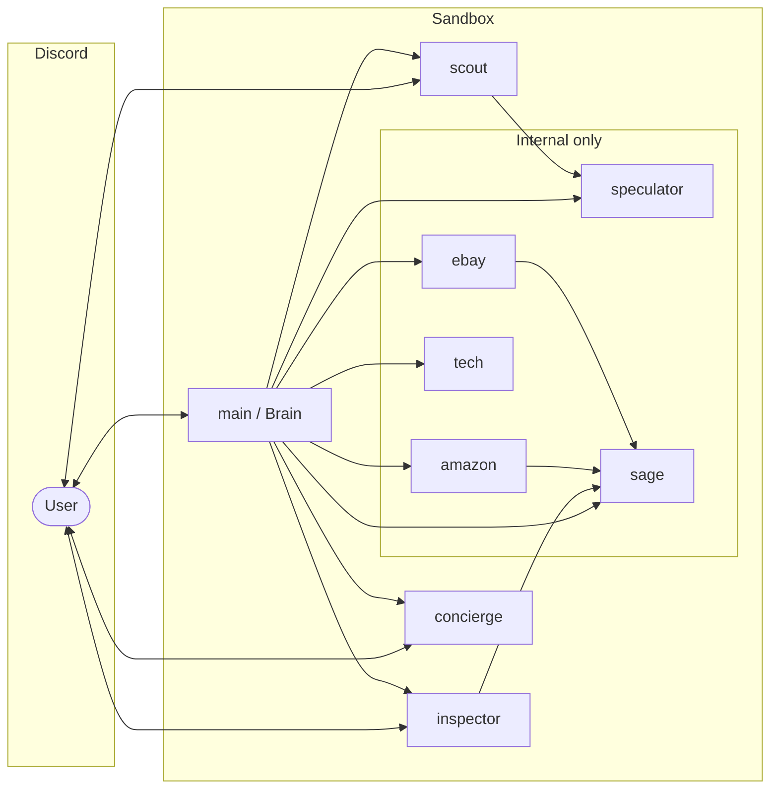

# External APIs, Datasets, Keys & Access Control

Companion to `unified_ecommerce_agent_architecture.md` (Saksham's six-agent
design) and `config/agents.yaml` (the enforcement). Scope: the daily GPU
price-watch MVP plus the review-audit loop.

## 1. Open APIs we will access

| API | Used by (agent) | What for | Cost / access | Key(s) needed |
|---|---|---|---|---|
| **eBay Browse API** | ebay | live listings, Buy-It-Now + auction prices, seller feedback | free developer program, OAuth client-credentials | `EBAY_APP_ID`, `EBAY_CERT_ID` (developer.ebay.com) |
| **Best Buy Products API** | tech | authoritative new-retail GPU prices + availability | free with approval (developer.bestbuy.com) | `BESTBUY_API_KEY` |
| **Amazon PA-API 5.0** | amazon | Amazon prices, availability, review counts | requires an Amazon Associates account **with qualifying sales** — realistically post-hackathon | `AMAZON_PAAPI_ACCESS_KEY`, `AMAZON_PAAPI_SECRET`, `AMAZON_PARTNER_TAG` |
| **Tavily Search** | scout, speculator | general price discovery, hardware news for trend calls | free tier (already configured) | `TAVILY_API_KEY` ✓ |
| **NVIDIA Endpoints** | all (inference) | the models themselves | already configured | `NVIDIA_INFERENCE_API_KEY` ✓ |
| **Discord API** | main, scout, inspector, concierge | chat + daily ping | free (already configured) | 4 × `DISCORD_BOT_TOKEN*` ✓ |

Amazon fallback until PA-API access exists: the amazon agent fetches product
pages directly (rate-limited, best-effort) — prices still flow into the daily
digest, marked `source:"page"` instead of `source:"api"`.
No official APIs exist for Newegg or PCPartPicker; the tech agent treats them
as page-fetch sources and prefers the Best Buy API for numbers we must trust.

## 2. Open datasets

| Dataset | Used for | Access |
|---|---|---|
| **Ott OpSpam v1.4** (1,600 gold-labeled deceptive/truthful reviews) | Sage benchmark (already the v0 baseline) | direct download ✓ (`benchmarks/download`) |
| **YelpChi / YelpNYC / YelpZip** (Rayana & Akoglu) | Sage metadata-aware benchmark | free for research, request form |
| **UCSD/McAuley Amazon Reviews** | product-domain transfer for Sage | direct download, no key |
| **GPTARD / ARED** (AI-generated review sets) | modern LLM-fake benchmark | per-paper release pages |
| **Our own `price-history/*.jsonl`** | Speculator's trend calls; grows daily from the 08:00 job | generated in-sandbox, committed nightly if desired |

No GPU price-history dataset is freely licensed (Keepa/CamelCamelCamel are
paid/no-API), so the daily job *builds our own* — day one of history starts
the morning after deployment.

## 3. Who talks to whom (enforced, not aspirational)

Delegation allowlists live in `config/agents.yaml`; Discord exposure is
decided by `scripts/wire-discord-bots.sh` bindings; egress is policed by the
OpenShell sandbox policy.

- **Discord-facing:** main, scout, inspector, concierge (own bot identities).
- **Internal only:** amazon, ebay, tech, speculator, sage — no Discord
  account, no binding; reachable solely by agent-to-agent delegation.
- **sage** is terminal: judges payloads it is handed; no network tools.

## 4. Secrets handling & isolation roadmap

**Now (single sandbox):** retail API keys enter as env vars; tool allowlists
limit which agents *use* them, and the identity layer forbids echoing
credentials into Discord. Honest limit: env and egress are sandbox-global, so
a compromised Discord-facing agent shares the blast radius.

**Next (per-trust-zone sandboxes):** split into `openclaw` (Discord-facing
team) and `retail` (amazon/ebay/tech + their keys), each with its own
OpenShell egress policy (retail: only `*.ebay.com`, `api.bestbuy.com`,
`*.amazon.com`; no Discord egress at all), talking over the gateway's
agent-to-agent channel. The deploy scaffold (`deploy/docker-compose/`) grows a
second sandbox service; on Kubernetes this becomes the Helm chart with one
sandbox per pod and NetworkPolicies mirroring the egress rules — the
retail-assistant example's `helm/` tree is the template.

## 5. The MVP loop (daily 08:00 digest)

1. User in `#gpu-desk`: `@Brain watch RTX 5090 daily` → `subscriptions.json`.
2. OpenClaw cron job (`gpu-daily-watch`, `0 8 * * *`) runs a main-agent turn:
   fan out to scout/amazon/ebay/tech → best price + links; append
   `price-history/rtx-5090.jsonl`; speculator reads history → trend.
3. One message to `#daily` (fallback `#gpu-desk`): best price, where, link,
   trend ↑/↓/→ with a one-line reason, subscriber tags.
4. Reactions on the digest feed Sage's reward loop (`benchmarks/` measures it).
