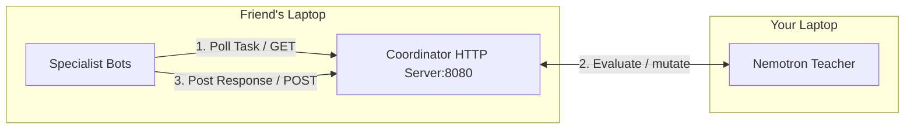
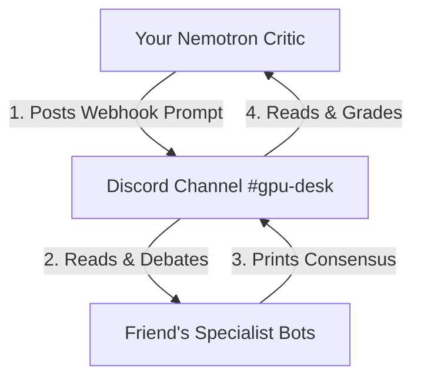

# Discord Bot Bridging & Integration Guide

This guide outlines how to bridge your local **Nemotron Teacher/Coordinator** with your friend's **Specialist Bots** running on a separate machine under their Discord developer accounts.

---

## The Architecture Challenge
By default, Discord bots ignore messages sent by other bots to prevent infinite processing loops (`if message.author.bot: return`). Since your specialist bots (Hermes/OpenClaw) are on your friend's laptop and your coordinator is on your laptop, you have two integration strategies to connect them.

---

## Strategy A: The Local HTTP REST API Bridge (Recommended)
Instead of relying on Discord text messages to sync the bots, use the local Python Coordinator API server as the centralized middleware. This avoids bot-to-bot blocking policies entirely.



### Steps to Implement:
1.  **Expose your Server:** Run `ngrok http 8080` on your laptop to expose your local Python server (running `scripts/nemotron_coordinator.py`) to a secure public URL (e.g. `https://random-subdomain.ngrok-free.app`).
2.  **Specialist Sourcing Code:** In your friend's bot codebase, add a simple polling routine that queries your Ngrok URL to fetch new prompts:
    *   Endpoint: `GET /api/status`
    *   If `status` is `"running"`, the specialist bot grabs the prompt, executes its sourcing logic, and posts the consensus back.
3.  **Consensus Submission:** Once the specialists form a consensus, they make a POST call back to your server:
    *   Endpoint: `POST /api/evaluations`
    *   Payload: `{ "A": score_a, "S": score_s, "P": score_p, "R": score_r, "C": score_c }`

---

## Strategy B: Shared Discord Server Bridge (Direct Webhooks)
If you prefer to keep all discussions visible inside Discord channels, you can bridge the bots by allowing cross-bot message processing.



### Steps to Implement:
1.  **Register your Bot Application:**
    *   Go to the [Discord Developer Portal](https://discord.com/developers/applications).
    *   Create a new Application named "Nemotron Critic".
    *   Under the "Bot" tab, toggle on **Message Content Intent** (required to read text in channels).
    *   Copy the Bot Token and add it to your local `scripts/nemotron_config.json`.
2.  **Add Both Bots to the Guild:**
    *   Ensure both your bot and your friend's bots are invited to the same Discord server.
3.  **Friend's Code Modification (Bypassing Bot Filtering):**
    *   Your friend must modify their message listener to allow your bot's messages.
    *   *Python Example:*
        ```python
        # Allow the Nemotron Critic Bot ID to bypass the bot filter
        CRITIC_BOT_ID = 123456789012345678  # Replace with your bot's actual ID
        if message.author.bot and message.author.id != CRITIC_BOT_ID:
            return
        ```
4.  **Your Coordinator Code Modification:**
    *   Add a listener in your python code that parses the channel messages, looks for the specialist bot's consensus keyword, and triggers evaluations.
