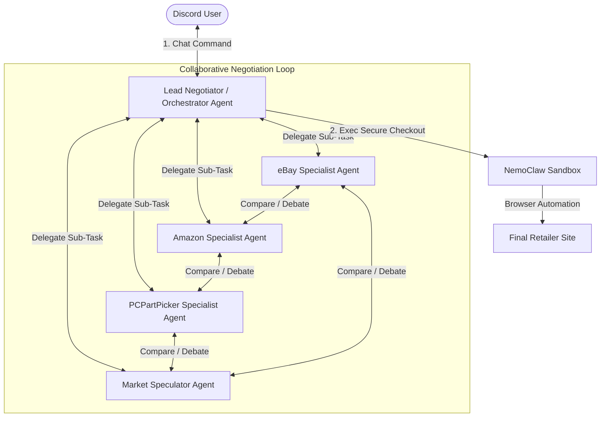

# Hackathon Proposal v3: Multi-Agent E-Commerce Specialist Network (NemoClaw)

This updated architecture adopts a **FactoryMind-inspired multi-agent design**. Instead of running a single linear script, the system deploys a network of **E-Commerce Specialist Agents** that talk to each other, analyze their respective marketplaces, debate price outlooks, and negotiate a unified recommendation for the user.

---

## 1. Multi-Agent Network Architecture

When a user submits a search request in Discord, the system spawns a **Consensus Debate** between specialized agent roles.

### Agent Roles & Responsibilities:

1.  **Lead Negotiator (Orchestrator):** 
    *   Acts as the customer-facing representative.
    *   Receives requests from Discord, parses budgets and target timelines, delegates search tasks to specialists, and hosts the "consensus debate" before generating the final Discord Embed.
2.  **eBay Specialist Agent:**
    *   *Expertise:* Secondary/refurbished markets.
    *   *Tools:* Scrapes/queries eBay search listings. Evaluates seller ratings, shipping fees, open-box items, and bidding history.
3.  **Amazon Specialist Agent:**
    *   *Expertise:* Primary retail convenience.
    *   *Tools:* Monitors Amazon prices, current coupon activations, prime delivery speeds, and inventory level alerts (e.g., "Only 2 left in stock").
4.  **PCPartPicker / Tech Specialist Agent:**
    *   *Expertise:* Broad vendor catalog and technical specs.
    *   *Tools:* Scrapes PCPartPicker or generic tech index pages to check alternative sites (Newegg, Best Buy, MicroCenter) and validates component compatibility.
5.  **Market Speculator Agent:**
    *   *Expertise:* Price forecasts & scarcity warnings.
    *   *Tools:* Analyzes news feeds, Reddit hardware subreddits, or external market indices to detect supply shortages, tariff warnings, or release cycles (e.g., "RTX 50-series announcement tomorrow will drop 40-series prices").

---

## 2. The Internal Negotiation: How the Agents Decide

To make the demo highly engaging for hackathon judges, you can stream the **behind-the-scenes debate** into a collapsible Discord thread. This shows the AI agents actively collaborating to solve the user's problem.

### Simulated Debate Log in Discord:
> **[Orchestrator]** 📢 User wants to buy an RTX 4070 GPU. Target: $450. Specialists, gather your data and report back.
> 
> **[Amazon Specialist]** 📦 Checking Amazon... The cheapest new RTX 4070 is currently $520. Stock levels are high. Shipping is free.
> 
> **[eBay Specialist]** 🔨 Checking eBay... I found an open-box model from a highly-rated seller (99.8%) for $465. There is also a bidding auction currently at $410 ending in 4 hours.
> 
> **[PCPartPicker Specialist]** 💻 Broad market scan shows Newegg has a discount code dropping their price to $505. Also, looking at the historical chart, the lowest price in the last 90 days was $480.
> 
> **[Market Speculator]** 📉 Crucial Alert: Tech news feeds report that Nvidia is announcing their new generation of GPUs next Tuesday. Based on historical product cycles, this announcement has a 90% correlation with immediate retail price drops on older stock.
> 
> **[Orchestrator]** 💡 Let's form a consensus:
> *   *eBay Specialist:* The auction at $410 is below budget but has bidding risks.
> *   *Market Speculator:* Suggests a market-wide price drop next week.
> *   *Conclusion:* We should recommend the user **WAIT**. The current lowest new retail price ($505 on Newegg) will likely fall closer to our $450 target after Tuesday's announcement.
> 
> **[Orchestrator]** Posting recommendation to main Discord channel...

---

## 3. How to Demonstrate This to Win the Hackathon

A multi-agent conversation is a great way to showcase "Demo-Driven Development." Here is how you can pitch and visualize this exact flow to the judges:

### Phase 1: The Request (0:00 - 0:45)
*   **Show:** The main Discord channel.
*   **Action:** Enter the command: `/buy GPU model:RTX 4070 budget:450`.
*   **Discord Output:** The Bot immediately creates a nested thread called `#gpu-hunt-debate` and links to it.

### Phase 2: Visualizing the Agent Conversation (0:45 - 1:45)
*   **Action:** Open the `#gpu-hunt-debate` thread.
*   **Show:** Live-stream the step-by-step chat logs between the **Amazon**, **eBay**, **PCPartPicker**, and **Market Speculator** agents as they post their findings.
*   **Pitch Point:** Explain that the agents aren't just fetching links—they are arguing points (shipping speed vs. seller reputation vs. future price trends) using different API inputs.

### Phase 3: The Consensus Recommendation (1:45 - 2:30)
*   **Show:** Return to the main channel. The Orchestrator has posted the final consensus card:
    *   `Status: WAITING`
    *   `Best Recommendation: Wait 4 Days`
    *   `Reasoning: Speculator Agent detects upcoming product launch. PCPartPicker Specialist highlights a current $505 Newegg deal, but eBay Specialist warns secondary market supply is spiking, suggesting retail cuts are imminent.`

### Phase 4: Secure Action Trigger (2:30 - 3:00)
*   **Action:** Click the `[⚡ Force Bid on eBay Auction]` button.
*   **Show:** The bot launches **NemoClaw's sandboxed browser** inside the thread, executing the bidding log automatically. It prints the confirmation screenshot showing the bid is placed at $415.

---

## 4. Why This Architecture Wins Hackathons

1.  **High Demo Value:** Seeing agents "talk" to each other inside a Discord thread makes the system feel incredibly intelligent, active, and conversational.
2.  **Clear Modular Design:** If you need to add a new retailer (e.g., Walmart or Best Buy), you just build a new "Specialist Agent" module rather than rewriting the entire price-scraping core.
3.  **Real-Time Reasoning:** Instead of returning a static list of links, the user gets a synthesized "expert opinion" compiled from multiple points of view.
