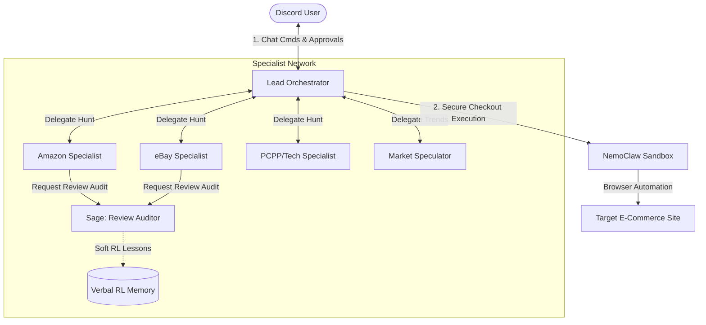

# Unified Multi-Agent E-Commerce Architecture (NemoClaw)

This document merges the **repository's phase-restricted architecture** (Scout, Inspector, Concierge, Sage) with the **user's source-specific predictive architecture** (eBay, Amazon, PCPartPicker, Speculator, secure sandbox checkout) into a single, cohesive system for the hackathon.

---

## 1. Comparison & Alignment Matrix

Before combining them, here is how the two conceptual designs compare:

| Category | Repository's Concept (`multi-agent-architecture.md`) | User's Concept (`ecommerce_agent_proposal.md`) | Combined Alignment |
|---|---|---|---|
| **Specialization** | By **Task Phase** (Find -> Vett -> Present -> Audit). | By **Data Source** (eBay, Amazon, PCPartPicker, Market Trends). | **Source-Specific Specialists** that handle both finding and initial inspection, routing reviews to a shared **Review Auditor (Sage)**. |
| **Transaction Exec** | **Human-Only:** Concierge provides links; no automated buying. | **Agent-Assisted:** Sandbox checkout via NemoClaw (approved by user button). | **Secure Sandbox Checkout:** Orchestrator initiates secure mock checkouts only after the user clicks a verification button. |
| **Price Forecasting** | Minimal (tracks current average and baseline). | **Predictive:** Speculator warns of price spikes using external news / cycles. | **Speculator-driven warnings** based on historical price indices and product launch cycles. |
| **Feedback Loop** | **Self-Improving (Soft RL):** Sage logs user feedback and improves review judging. | Static price-target alerts. | **Reflexion (Sage):** Users rate Sage's fake-review verdicts to refine search patterns over time. |

---

## 2. Combined Agent Team

By merging the architectures, we create a six-agent panel. Each agent has restricted permissions enforced by NemoClaw policies.

### Roles and Responsibilities:

1.  **Lead Orchestrator (Brain):**
    *   *Role:* User interaction & task management.
    *   *Action:* Parses Discord user commands, coordinates the specialist dialogue, presents the unified shortlist, handles purchase buttons, and invokes NemoClaw checkouts.
2.  **Amazon Specialist (Scout + Inspector for Amazon):**
    *   *Role:* Primary retail monitoring.
    *   *Action:* Scrapes Amazon listings, checks shipping speed, extracts review text, and passes listing context to Sage.
3.  **eBay Specialist (Scout + Inspector for eBay):**
    *   *Role:* Secondary/refurbished market monitoring.
    *   *Action:* Gathers eBay Buy-It-Now and auction listings, seller ratings, shipping fees, and passes auction histories to Sage.
4.  **PCPartPicker/Tech Specialist (Scout + Inspector for Tech catalog):**
    *   *Role:* Broad hardware validation & historical price tracking.
    *   *Action:* Checks component specs, evaluates compatibility, and compares other vendors (Newegg, Best Buy).
5.  **Market Speculator:**
    *   *Role:* Price-hike forecasting.
    *   *Action:* Scours hardware announcement news, supply chain updates, and price indices to warn of upcoming shortages or price drops.
6.  **Sage (Self-Improving Review Auditor):**
    *   *Role:* Fraud/Deceptive listing detection.
    *   *Action:* Receives reviews + metadata from eBay/Amazon specialists, analyzes them for deceptive patterns (account age, bursts), and outputs a rating. Refines its rules over time from user feedback (Thumbs up/down).

---

## 3. Demo Integration Workflow (The Pitch)

Here is how to pitch this combined architecture during your live presentation, highlighting how it utilizes **NemoClaw** and **Demo-Driven Development**:

### Step 1: The Request
*   The user requests an RTX 4070 for under $480 in the main Discord channel.
*   The **Lead Orchestrator** creates a thread: `#rtx4070-negotiation`.

### Step 2: The Agent Debate (Live-streamed in the thread)
*   **Amazon Specialist** finds a new listing for $520.
*   **eBay Specialist** finds a listing for $445 from a new seller (feedback score: 12). It passes the seller reviews to **Sage**.
*   **Sage** inspects the reviews and flags them: `[Sage Audit: Rating MED-HIGH Risk. Review texts contain 95% semantic similarity, and seller account is 3 days old. Recommend REJECTING this listing.]`
*   **Market Speculator** scans hardware cycles: `[Speculator Alert: RTX 50-series drops in 5 days. Retail stores will discount RTX 40-series to clear stock. Recommend WAITING for price drops.]`
*   **PCPartPicker Specialist** confirms compatibility: `[PCPP Check: Listing matches user's system specs. Newegg price is $500.]`

### Step 3: Synthesis & Action
*   The Orchestrator summarizes in the main channel:
    > "I recommend waiting 5 days due to the upcoming GPU product launch. If you need it now, the cheapest safe option is Newegg at $500. I filtered out an eBay listing for $445 because Sage flagged it as a high-risk fake review listing."
*   If the user chooses to proceed with the Newegg deal, they click `[🔐 Execute Checkout]`.
*   NemoClaw launches a secure browser session, adds the item to the cart, completes mock payment forms, and returns a checkout confirmation.

### Step 4: The Self-Improving Feedback Loop
*   The user reacts with a 👍 to Sage's verdict block.
*   Sage writes a lesson to its memory buffer: `[Reflection: Verified that seller account age < 7 days combined with high review text similarity is a strong signal for deceptive listings. Retaining rule.]`

---

## 4. Hard Sandboxing Policies (NemoClaw Guardrails)

To ensure this complex setup is stable and secure on NemoClaw, enforce these per-agent policies:

1.  **Orchestrator Sandbox Policy:** Can only send/receive messages on Discord. Egress block to any other domain.
2.  **Amazon/eBay Specialist Sandbox Policy:** Egress restricted only to `*.amazon.com` or `*.ebay.com`. Cannot access search engines or other APIs.
3.  **Sage Sandbox Policy:** Completely isolated. No network egress allowed (receives data payload via local agent-to-agent message passing and processes it). Keeps security robust.
4.  **NemoClaw Checkout Sandbox Policy:** Strict allowlist of target checkout endpoints (e.g. Newegg checkout URLs). Session tokens are encrypted and isolated from other agents' read access.
